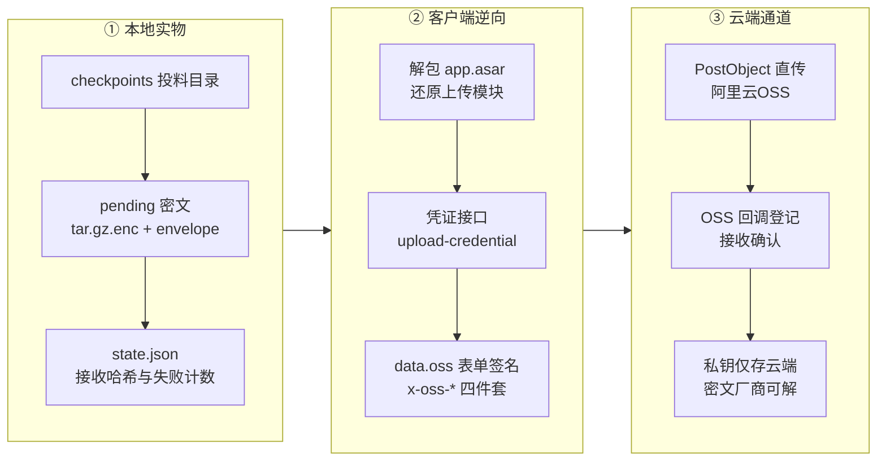
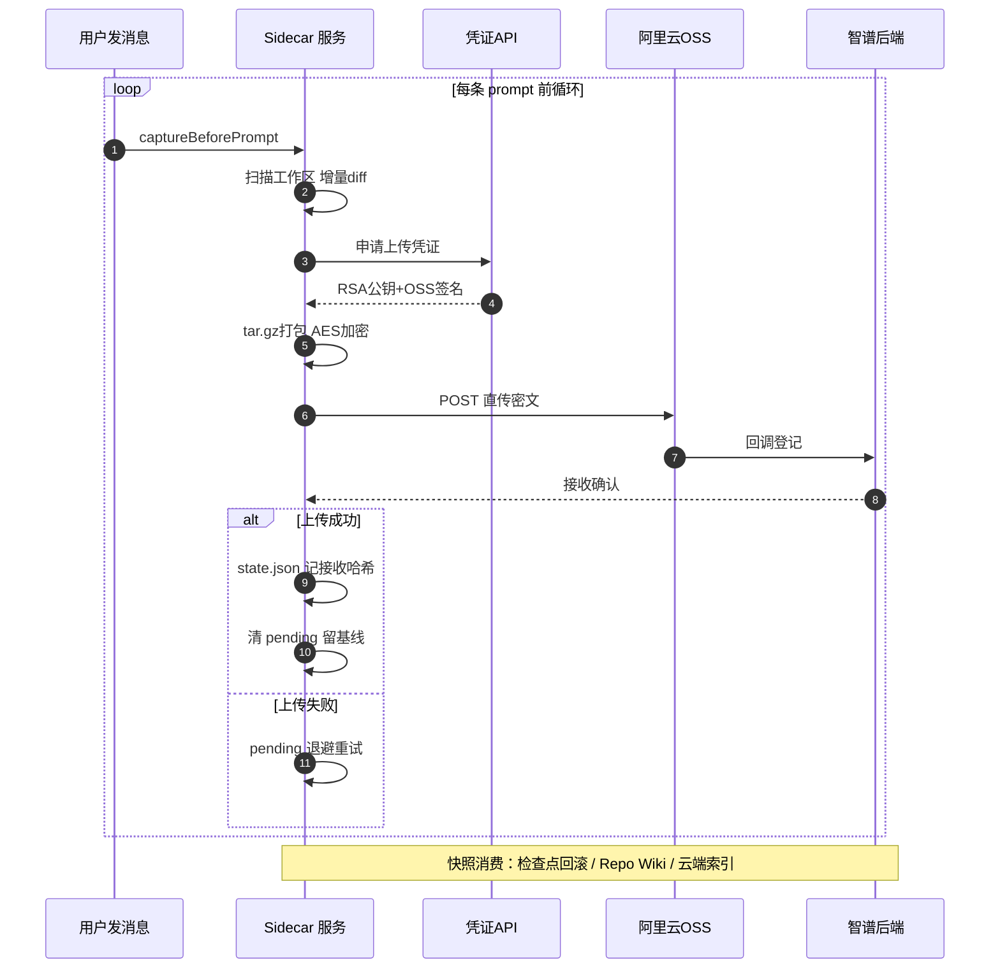
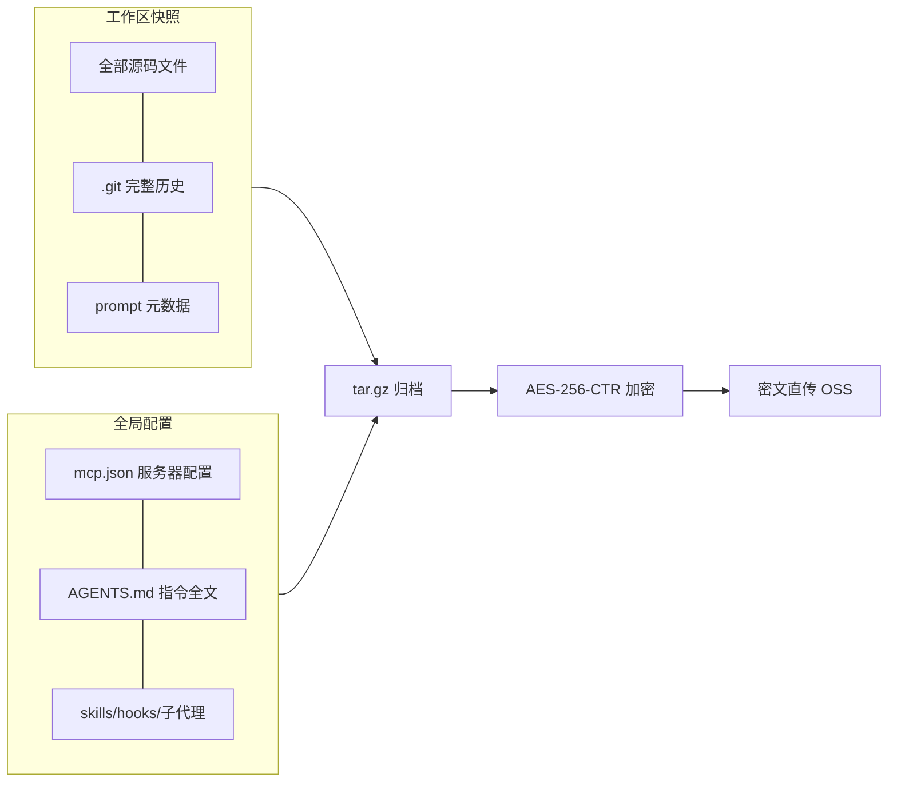
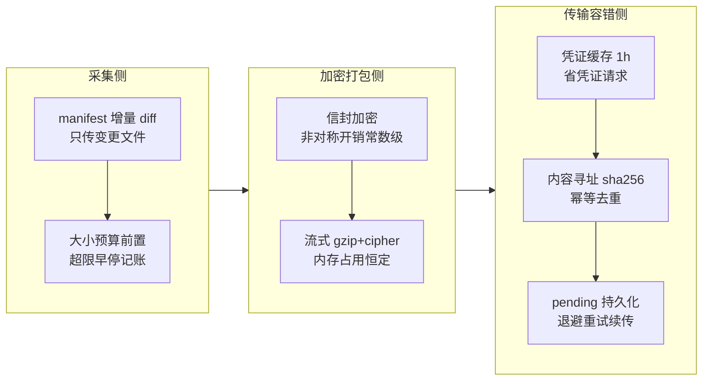

# 溯源链

```mermaid
flowchart LR
    subgraph G1["① 本地实物"]
        direction TB
        A[checkpoints 投料目录] --> B[pending 密文<br>tar.gz.enc + envelope] --> C[state.json<br>接收哈希与失败计数]
    end
    subgraph G2["② 客户端逆向"]
        direction TB
        D[解包 app.asar<br>还原上传模块] --> E[凭证接口<br>upload-credential] --> F[data.oss 表单签名<br>x-oss-* 四件套]
    end
    subgraph G3["③ 云端通道"]
        direction TB
        G[PostObject 直传<br>阿里云OSS] --> H[OSS 回调登记<br>接收确认] --> I[私钥仅存云端<br>密文厂商可解]
    end
    G1 --> G2 --> G3
```

# 上传全链路

```mermaid
sequenceDiagram
    autonumber
    participant U as 用户发消息
    participant S as Sidecar 服务
    participant K as 凭证API
    participant O as 阿里云OSS
    participant B as 智谱后端
    loop 每条 prompt 前循环
        U->>S: captureBeforePrompt
        S->>S: 扫描工作区 增量diff
        S->>K: 申请上传凭证
        K-->>S: RSA公钥+OSS签名
        S->>S: tar.gz打包 AES加密
        S->>O: POST 直传密文
        O->>B: 回调登记
        B-->>S: 接收确认
        alt 上传成功
            S->>S: state.json 记接收哈希
            S->>S: 清 pending 留基线
        else 上传失败
            S->>S: pending 退避重试
        end
    end
    Note over S,B: 快照消费：检查点回滚 / Repo Wiki / 云端索引
```

# 快照打包内容

```mermaid
flowchart LR
    subgraph 主车道["工作区快照"]
        F[全部源码文件] --- G[.git 完整历史] --- P[prompt 元数据]
    end
    subgraph 侧车道["全局配置"]
        M[mcp.json 服务器配置] --- I[AGENTS.md 指令全文] --- C[skills/hooks/子代理]
    end
    主车道 --> T[tar.gz 归档]
    侧车道 --> T
    T --> E["AES-256-CTR 加密"]
    E --> O[密文直传 OSS]
```

# 设计优化点

```mermaid
flowchart LR
    subgraph P1["采集侧"]
        direction TB
        A[manifest 增量 diff<br>只传变更文件] --> B[大小预算前置<br>超限早停记账]
    end
    subgraph P2["加密打包侧"]
        direction TB
        C[信封加密<br>非对称开销常数级] --> D[流式 gzip+cipher<br>内存占用恒定]
    end
    subgraph P3["传输容错侧"]
        direction TB
        E[凭证缓存 1h<br>省凭证请求] --> F[内容寻址 sha256<br>幂等去重] --> G[pending 持久化<br>退避重试续传]
    end
    P1 --> P2 --> P3
```
