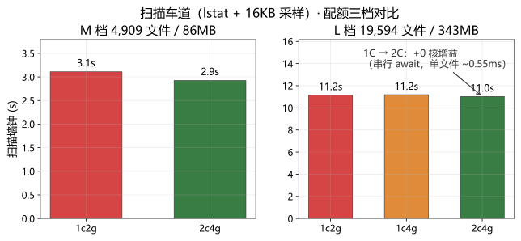
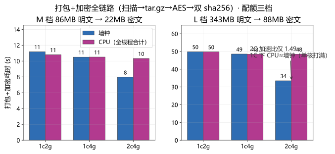
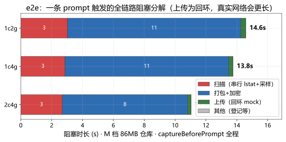
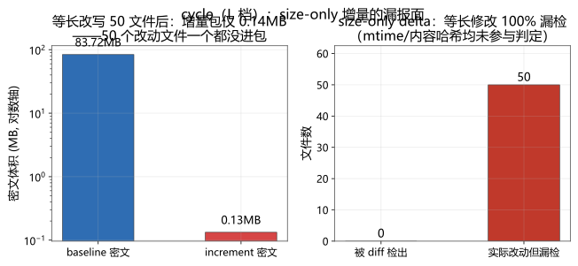
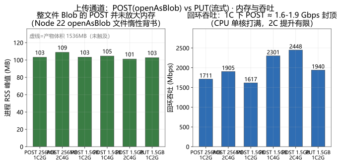
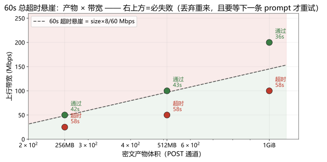
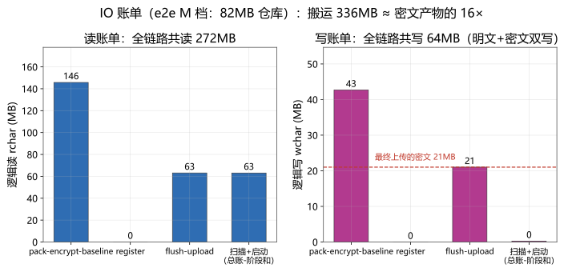
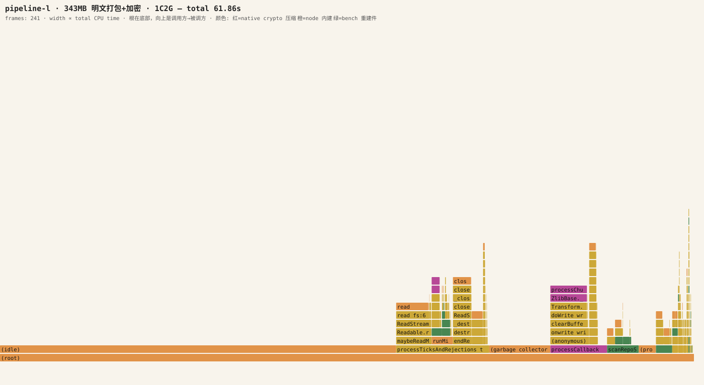
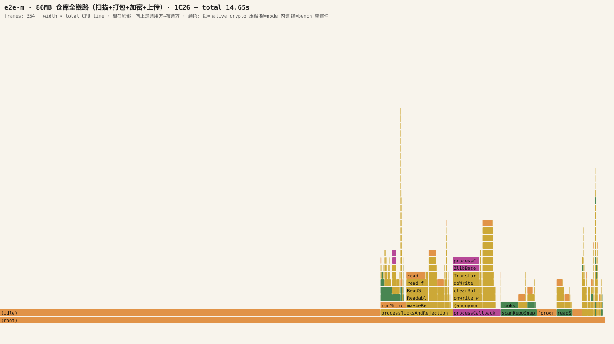
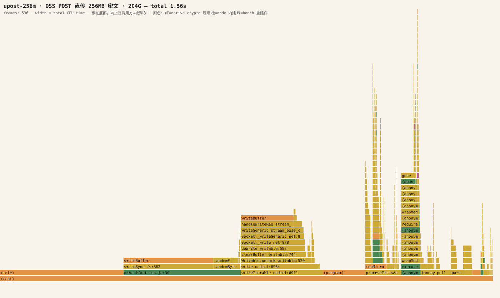

# 02 · 低资源容器压测与火焰图热点分析

> **对象**：[src/readable-2.0](../../src/readable-2.0/) 所述快照上传热路径。
> **重建件声明**：压测在 `bench/`，是按 readable-2.0 **逐函数对齐的可执行重建件**，
> 不是 ZCode 代码、不可用于取证引用；上传端点为回环 mock（数据即收即弃，无外发），
> "服务端 RSA 公钥"本地生成，凭证进程内发放。缺陷结论见
> [01-defects](01-defects.md)，本篇只谈**性能形状与短板数据**。

## 方法学

**配额环境**：WSL2 → Docker（cgroup v2）真容器配额，三档：

| 档位 | --cpus | --memory（swap 同额，即无 swap 余量） |
|------|--------|--------------------------|
| 1C2G | 1 | 2g |
| 1C4G | 1 | 4g |
| 2C4G | 2 | 4g |

1C2G↔1C4G 隔离**内存**约束，1C4G↔2C4G 隔离**CPU** 核数——单变量对照。
镜像 `node:22-slim`（Debian, Node 22.23.2），fixtures 为容器内 ext4 卷上的合成
git 仓库（确定性种子，98% 文本 + 2% 二进制，2% 二进制用于走扫描过滤分支）。

**负载档**：S=500 文件（~8.6MB）/ M=5k 文件（~87MB）/ L=20k 文件（~350MB）。

**场景**：

| 场景 | 测什么 |
|------|--------|
| scan | 串行 lstat+16KB 采样的扫描车道（D13） |
| pipeline-baseline | 扫描→manifest 哈希→tar.gz→AES 加密→双 sha256 全链（D14、D8） |
| cycle | baseline → 等长改写 50 文件 → increment（D1 漏报 + 增量成本） |
| e2e | 采集→登记→flush→回环上传（"每条 prompt 被阻塞多久"） |
| upload-probe | POST(openAsBlob+FormData) vs PUT(流式) 的墙钟/内存（D7） |
| cliff-*(矩阵2) | 体积 × 带宽的 60s 超时悬崖（D10），含 PUT 流式对照 |
| reject-after-hash | key_expired 前被迫付出的全文件哈希（D8） |
| manifest-scale | 100k 条目 manifest 的哈希/双重序列化/解析（D14） |
| io-*(矩阵2) | 每阶段 `/proc/self/io`（逻辑读写字节）+ cgroup `io.stat` 增量——IO 账单 |

**测量**：每阶段 wall + CPU（`process.resourceUsage`，全线程合计）、RSS 峰值
（50ms 采样）+ `VmHWM` + cgroup `memory.peak`；OOM 以容器退出码 137 判定。
CPU profile 用 `node --cpu-prof`（1ms 采样，**只采主线程**——zlib/crypto 在 libuv
线程池里的工作在主线程样本中呈现为 `(idle)`，因此全线程 CPU 时间以
resourceUsage 为准，两者并列报告）；火焰图由 `bench/flame.js` 从 `.cpuprofile`
聚合生成（根在底部，宽度 ∝ total CPU；native crypto/zlib 标红、native streams
标紫、node 内建标橙、重建件标绿）。分配行为尝试过 `--heap-prof`，负结果见
[内存与 buffer 行为](#内存与-buffer-行为)。

**保真度对照**（重建件 vs 原文，`bench/README.md` 有完整表）：串行扫描循环、
size-only delta、tar.gz tmp+rename+逐条目限额、CTR+RSA-OAEP 信封、明文先落盘、
60s 上传总超时、换目标前全量密文哈希、POST/PUT 双通道——全部按 readable-2.0
语义重建。**未重建**：真实 OSS RTT/持久化（回环替代，数据量守恒）、并发多工作区、
真实凭证网络往返（进程内 O(1)）。因此绝对值偏乐观，短板结论以**相对形状**为准。

（以下数字与图为 2026-09-18 实测；原始 JSON 在 `bench/results/`，图表源码
`bench/charts.py`，重跑 `python bench/charts.py` 再生成。）

## 结果

### 扫描车道：串行，双核零增益（D13）

| 档 | 配额 | 文件数 | 扫描墙钟 | 其中 lstat+16KB 采样 |
|----|------|--------|----------|------------------|
| M | 1C2G | 4,909 | 3.11s | 3.08s（99%） |
| M | 2C4G | 4,909 | 2.92s | 2.90s |
| L | 1C2G | 19,594 | 11.16s | 10.44s |
| L | 2C4G | 19,594 | 11.03s | 10.98s |
| L | 1C4G | 19,594 | 11.19s | 10.37s |

单文件成本稳定在 **~0.55ms**（M 档 0.63 / L 档 0.53），瓶颈是每文件一次
`lstat` + 一次 16KB 读的**同步往返串行链**——1C→2C 墙钟纹丝不动（11.16s →
11.03s）。每条 prompt 都重扫一遍：20k 文件仓库每次先白付 ~11 秒扫描。

### 打包+加密：1C 单核打满，2C 仅 ~1.4×（形态受线程池/主线程结构限制）

| 档 | 配额 | 墙钟 | CPU（全线程） | 吞吐（明文） |
|----|------|------|--------------|--------------|
| M（86MB→22MB 密文） | 1C2G | 11.18s | 10.80s | 7.7 MB/s |
| M | 1C4G | 10.50s | 10.51s | 8.2 MB/s |
| M | 2C4G | 7.96s | 10.32s | 10.8 MB/s |
| L（343MB→88MB 密文） | 1C2G | 49.86s | 49.80s | 6.9 MB/s |
| L | 1C4G | 48.58s | 48.46s | 7.1 MB/s |
| L | 2C4G | 33.52s | 48.49s | 10.2 MB/s |

1C 下 CPU≈墙钟（单核 100% 饱和）；内存翻倍无感（1C2G≈1C4G，本来也没到内存
瓶颈）。第二颗核只买回 **1.40×（M）/ 1.49×（L）**——gzip/AES 部分并行了，但
tar 装配、manifest/JSON、背压调度都在主线程串行。343MB 仓库在最低配额档一次
打包+加密 **50 秒**，这发生在用户敲下回车之后的采集链上。

### e2e：一条 prompt 阻塞 11–14 秒，81% 花在打包+加密

M 档（86MB 仓库）`captureBeforePrompt` 全链：1C2G 13.8s / 1C4G 12.9s /
2C4G 11.0s，其中打包+加密 11.2s（81%）、扫描 2.9s（21%）。上传是回环 mock
（0.32s）——真实网络下只会更长。**用户每发一条消息，都有一次十几秒的静默税**。

### 增量：size-only delta 等长修改 100% 漏检（D1）

L 档 baseline（88MB 密文）→ 等长改写 50 个文件 → increment：diff 检出
**0 个**（漏检 50/50），增量包仅 **0.13MB**、打包 53ms——增量车道本身又快又
便宜，但判据只有 `sizeBytes`，**改动对增量与 manifest 哈希同时不可见**，云端
基线静默漂移。

### 上传通道：内存不放大，但 CPU 单核封顶 + 60s 悬崖

回环不限速下：POST 256MB 1.2s、1.5GB 7.6s（1C 下 ~1.6–1.9 Gbps 封顶，CPU
单核打满；2C 提升有限）。**RSS 峰值恒定在 ~104–114MB**，与产物体积（256MB →
1.5GB，16×）无关：Node 22 的 `openAsBlob` 是文件惰性背书，按需分块读取，
**整文件 Blob 并不放大堆内存**（对 01-defects D7 的"内存放大"担忧是修正：
在 Node 22 语义下不成立；Electron 内置运行时的行为未验证）。cgroup `memory.peak`
到 1.71GB 的是**页缓存**（可回收，未触发 OOM，exit=0）。

### 60s 超时悬崖：带宽 < size×8/60 Mbps 即必败（D10）

| 产物 | 带宽 | 60s 悬崖线 | 结果 |
|------|------|-----------|------|
| 256MB | 25Mbps | 34Mbps | **超时**（60.0s abort，发出 ~76%） |
| 256MB | 50Mbps | 34Mbps | 通过（41.8s） |
| 512MB | 50Mbps | 68Mbps | **超时**（60.0s abort，发出 ~72%） |
| 512MB | 100Mbps | 68Mbps | 通过（43.0s） |
| 1GiB | 100Mbps | 137Mbps | **超时**（60.0s abort，发出 ~70%） |
| 1GiB | 200Mbps | 137Mbps | 通过（35.7s） |
| 1GiB · PUT 流式 | 100Mbps | 137Mbps | **超时**（60.0s abort，发出 ~72%） |

七个点与理论悬崖线 `mbps* = size×8/60` 完全吻合。60s 总超时不随体积缩放，
意味着：**家宽/弱网（≤100Mbps 上行）+ 大仓库密文 >700MB = 100% 失败**；已发出
的字节全部作废（POST 无断点续传），失败后走 `failPendingUpload` 丢弃，重试要
等**下一条用户消息**（D4）。PUT 流式通道在超时面前同样无救——它救内存，救不了
墙钟。

### IO 账单：为 22MB 密文搬运 352MB（16×）（D2/D8 的磁盘视角）

`/proc/self/io` 逻辑读写增量（回环 mock 的收包侧读数也计入，客户端净搬运约为
下表减半——倍数量级不变）：

| 阶段（e2e M 档，86MB 仓库） | 读 rchar | 写 wchar | 说明 |
|------------------------------|----------|----------|------|
| 扫描+启动 | 66MB | ~0 | 16KB×4909 采样，只为判二进制 |
| 打包+加密 | 153MB | 45MB | tar 读源 86MB + 明文 sha 22MB + AES 再读明文 22MB；写明文 tar.gz 22MB + 密文 22MB |
| flush 上传 | 66MB | 22MB | 密文 sha256（换目标前）22MB + Blob 读 22MB + mock 收包 22MB |
| **合计** | **285MB** | **67MB** | **= 22MB 产物的 16×** |

L 档同构：88MB 产物搬运 1,053MB（12×）。要点：

1. **明文+密文双写**（D2）：`write_bytes` 44.5MB 恰好等于两份产物——密文之外
   还有一份完整明文 tar.gz 先落盘；cgroup 写放大到 156MB（overlay CoW 叠加）。
2. **密文被读 3 遍**（D8）：加密后哈希一遍、换目标前哈希一遍、上传读一遍——
   哈希结果不持久化复用是纯浪费；`reject-after-hash` 实测 key_expired 前先付
   **790ms**（256MB），外推 2GiB 上限产物 ≈ 6.4s/次。
3. 物理读 `read_bytes`≈0：fixtures 刚拷入容器、页缓存全热——**冷缓存下物理读
   至少再加一遍源文件体积**，实际形状只会更差。

### manifest 规模与每条 prompt 的固定税（D14/D16）

100k 条目：canonical 哈希 179ms + 双重 2 空格序列化 86ms（8.3MB JSON ×2）+
超限路径 parse 40ms ≈ **每条 prompt ~305ms 固定开销**；files 数组常驻堆
13.2MB/仓库（多工作区叠加）。凭证"缓存"无命中逻辑（D16），每条 prompt 还有
一次凭证 GET 的网络往返（重建件里是 O(1)，真实环境是 RTT）。

## 火焰图

三张 CPU 火焰图（SVG，tooltip 悬停可见 total/self；数据表在
[assets/flame/](../../assets/flame/) 同名 `.md`）：

### pipeline-l（343MB 打包+加密，1C2G，61.9s profile）

主线程 `(idle)` 占 57%——**不是没事干，而是单核被 libuv 线程池的 gzip/AES
占着**，主线程在等（全线程 CPU 49.8s 见上表）。可见 JS 侧热点：

| 热点 | self | 解读 |
|------|------|------|
| `(garbage collector)` | 8.8% | buffer/JSON 分配churn（见下节） |
| `processChunk`/`processCallback`（zlib） | 6.6% | 压缩回主的线程部分 |
| `read`/`close`/`open`/`lstat` | ~11% | 扫描车道 + tar 读源的 syscall 风暴 |
| `scanRepoSnapshot`（含 `looksBinary`） | ~1.1% self / 2.8s total | 串行扫描的 JS 侧可感部分 |

### e2e-m（86MB 全链，1C2G，14.6s profile）

形状同上缩小版：`(idle)` 62.9%、zlib ~7%、`looksBinary` 2.9%（428ms 纯为判
二进制扫字节）、syscall 类 ~8%。上传与状态机部分小到进不了 top（回环下 0.3s）。

### upost-256m（POST 直传 256MB，2C4G，1.56s profile）

上传通道本质是 **memcpy 竞赛**：`writeBuffer`（socket 写）3 个帧合计 ~29%，
`readNext`（blob:330，文件惰性分块读）+ undici `pull/writeIterable` 构成
按需拉取链——**没有整文件驻留**，与 RSS 恒定 ~110MB 互证。`randomFillSync`/
`generateKeyPairSync`（~100ms）是 mock 的本地密钥生成开销，真实链路无此项。

## 内存与 buffer 行为

回应"这条链的内存 buffer 相关性"：

1. **上传不放大内存**（实测）：RSS 恒 ~104–114MB，与产物 16× 体积差无关；
   Node 22 `openAsBlob` 文件惰性背书 + undici 按需拉取，慢 socket（25Mbps
   限速跑 60s）下也不积水（RSS 105MB）。
2. **buffer 都在堆外**：`--heap-prof` 只采到 **2.0MB** JS 堆分配（见
   [heap-pipeline-m-1c2g.svg](../../assets/flame/heap-pipeline-m-1c2g.svg)）——
   16KB 采样缓冲、tar/gzip 块、AES 分块全是 Buffer（external/ArrayBuffer），
   不走 V8 堆。堆上行为的正确信号是 CPU 图里的 **GC 8.8%**（pipeline-l）：
   buffer/字符串 churn 的间接账单。
3. **cgroup 峰值高但无 OOM 风险**：1.71GB 的 `memory.peak` 是文件页缓存
   （可回收），匿名内存（RSS）始终 ~140MB 内；2G 配额下 1.5GB 产物全程 exit=0。
   真正的配额压力在**磁盘**（明文+密文双写 ×2）与 **CPU**（单核 50s），不在内存。

## 短板结论与建议（按实测影响排序）

| # | 短板 | 实测证据 | 对应缺陷 | 修复方向 |
|---|------|----------|----------|----------|
| 1 | 60s 超时 × 体积：弱网必败且不可续传 | 悬崖 7 点全中理论线；PUT 同败 | D10+D4 | 超时按 size/带宽缩放或分片+断点；retained 加退避定时器 |
| 2 | 打包+加密单核 50s（343MB），prompt 级阻塞 | 1C CPU≈墙钟；2C 仅 1.4×；e2e 81% | —（性能形态） | 降压缩级别/分片流水线/增量真正生效后只打包增量 |
| 3 | size-only delta 等长修改全漏 | 50/50 漏检，增量 0.13MB | D1 | diff 纳入 mtime/内容哈希 |
| 4 | 串行扫描每 prompt ~11s（20k 文件） | 1C≈2C≈1C4G，0.55ms/文件 | D13 | 有界并发池（32 并发 ≈ 数量级） |
| 5 | IO 搬运 12–16× 于产物 | e2e 285R+67W/22MB；双写；密文读 3 遍 | D2+D8 | tar→gzip→aes 单 pipeline 直写；哈希持久化复用 |
| 6 | 每条 prompt 固定税 ~0.3s+1 次凭证 GET | manifest-100k 305ms | D14+D16 | manifest 流式序列化；凭证按 workspace 命中缓存 |

*实测：2026-09-18 · 主矩阵 20 场景（`bench/matrix.sh`）+ 补充矩阵 10 场景（`bench/matrix2.sh`：IO 账单/heap-prof/带宽悬崖）· 原始数据 `bench/results/` · 图表源码 `bench/charts.py`、`bench/flame.js`、`bench/heapflame.js` · 58 项结论断言 `bench/verify.py` 全绿 · 修复排期见 [03-improvement-plan](03-improvement-plan.md)*
